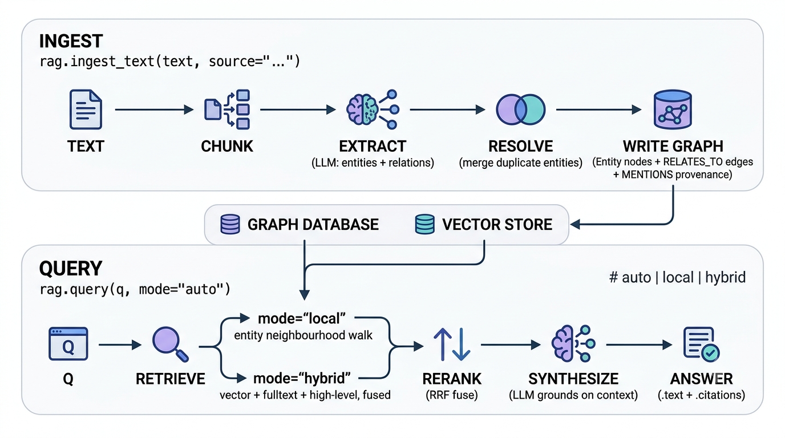

# What is Graph-RAG?

`runic.rag` turns unstructured documents into a knowledge graph and answers
questions over it with citations. Graph-RAG is retrieval-augmented generation
where the unit of retrieval is not a loose pile of text snippets but a graph of
**entities**, **typed relations**, and the **source chunks** they came from.
This page explains the idea; the [quickstart](./quickstart.md) shows the code.

---

## Start with classic RAG

Plain vector RAG is the baseline everyone starts from, and it works like this:
split your documents into chunks, embed each chunk into a vector, store the
vectors, and at query time embed the question and pull back the top-k nearest
chunks. Those chunks are pasted into the prompt, and the LLM writes an answer
grounded in them.

It is popular for good reasons. It is simple to build, cheap to run, and needs
no schema — you point it at a folder and it works. For "find the passage that
talks about X" questions, nearest-neighbour search over embeddings is hard to
beat.

---

## Where vector-only RAG hits a wall

The trouble starts when the answer is not sitting in one chunk. Two question
shapes expose the limit:

- **Multi-hop questions.** "How is Ada Lovelace connected to Alan Turing?" The
  link runs through the Analytical Engine, Charles Babbage, and the idea of a
  universal machine — facts that may live in three different documents. Each
  chunk is individually relevant, but none contains the *connection*. Top-k by
  similarity returns the pieces and leaves the LLM to guess how they join up.
- **Thematic / global questions.** "What are the main themes across these
  reports?" No single chunk holds the answer, because the answer is an
  *aggregation* over many chunks. Similarity search has nothing to rank against
  a question that is about the whole corpus.

The insight is that vector search optimises for **similarity**, but these
questions need **relationship** and **aggregation**. A graph models exactly
those.

---

## Where the ideas come from

`runic.rag` is a synthesis, not an invention. Four open Graph-RAG frameworks
each contribute a piece; here is what `runic.rag` borrows from each.

| Framework | Core idea in plain language | What `runic.rag` borrows |
| --- | --- | --- |
| **Microsoft GraphRAG** | Extract a graph, cluster it into communities, summarise each, and answer local *or* global questions over the hierarchy. | The local-vs-broad split in retrieval. (Community clustering + global summaries are an opt-in extension, not shipped.) |
| **LightRAG** | A fast, incremental alternative with no community step: retrieve at two levels — specific entities and high-level themes — and merge new data instead of rebuilding. | Dual-level retrieval (entity neighbourhood + theme keywords) and incremental, rebuild-free ingestion via graph `MERGE`. |
| **Graphiti / Zep** | A context graph for agent memory: keep provenance from every fact back to its source, and fuse vector + keyword + graph search with reranking. | Source-chunk provenance (`MENTIONS`) and hybrid retrieval fused with Reciprocal Rank Fusion (RRF). |
| **LlamaIndex PropertyGraphIndex** | Composable graph extraction and retrieval, with a schema-guided `strict=True` mode and a free-form `strict=False` mode. | The composable port architecture and the `strict=False`-style hybrid schema as the default. |

Together they cover a spectrum from "expensive and thorough" to "light and
incremental." `runic.rag` deliberately takes the cheap-but-high-value 90% — and
is the only one built on an OGM with versioned schema migrations rather than its
own bespoke store.

---

## Why a graph helps

The graph is **derived automatically** during ingestion. The LLM reads each
chunk and extracts the entities it names (people, organizations, concepts, …)
and the typed relations between them. Those become nodes and edges:

- A **multi-hop** question becomes a *walk* over edges. Starting from "Ada
  Lovelace", you follow `RELATES_TO` edges to "Analytical Engine", then to "Alan
  Turing" — the connection the question asked for is a literal path, not
  something the LLM has to reconstruct from disjoint snippets.
- Every extracted entity and relation keeps a `MENTIONS` link back to the source
  **chunk** it came from. That is **provenance**: every fact in an answer is
  traceable to the exact passage that produced it, which makes answers *citable*
  and extraction errors *debuggable*.

So the graph adds the structure vector search lacks, and the source chunks keep
the grounding vector search had.

---

## The hybrid ontology

The centerpiece design choice is a **hybrid ontology**: hard entity types, soft
relations.

- **Hard entity types.** Entities are drawn from a constrained vocabulary you
  control — `Person`, `Organization`, `Concept`, and so on. Each type is a real
  polymorphic OGM label (`labels=["Entity", T]`), so a `Person` is both an
  `Entity` and a `Person`. The extractor is told the allowed types, keeping the
  graph clean and queryable by type, and every `Entity` also carries an indexed
  `type` field for fast filtering. Precision where it pays off.
- **Soft relations.** Relations are *not* a fixed schema. Every edge is a single
  `RELATES_TO` type with the specific kind stored in a `rel_type` property
  (`"founded"`, `"worked with"`, `"invented"`, …). New relation kinds need no
  schema change — they are just new property values. Flexibility for the long
  tail, mirroring LlamaIndex's `strict=False` as the default.

This buys structure where structure is cheap and stable (a handful of entity
types) and freedom where it is expensive and open-ended (the endless variety of
relations). Designing that vocabulary is the single highest-leverage knob you
have — see [ontologies](./ontologies.md).

---

## runic.rag in one picture

`runic.rag` is a **thin SDK** over `runic.ogm` (the object-graph mapper) and
`runic.migrate` (schema versioning). The knowledge graph *is* an ordinary OGM
graph: the same nodes, edges, and indexes you would model by hand, created via
the OGM's `SchemaManager` and managed with migrations. Because persistence lives
in the OGM, the same code is **backend-portable** across FalkorDB, Neo4j, and
the other supported drivers. Every pipeline stage is a default adapter that you
can swap — batteries included, nothing welded shut (see
[writing custom ports](./custom-ports.md)).

The pipeline has two lanes — one to **build** the graph, one to **query** it:

`mode="auto"` is a cheap heuristic, not an LLM call: short, entity-pointed
questions go to `local`; broad or thematic ones go to `hybrid`. See
[retrieval](./retrieval.md) for the details.

---

## Vector RAG vs Graph-RAG

A short, honest contrast:

- **Unit of retrieval.** Vector RAG retrieves chunks. Graph-RAG retrieves
  entities and relations *and* their source chunks — structure plus grounding.
- **Question shape.** Vector RAG shines at single-passage lookups. Graph-RAG
  adds multi-hop ("how is X connected to Y?") and benefits thematic questions by
  walking and aggregating the graph.
- **Structure & provenance.** The graph captures relationships explicitly, and
  `MENTIONS` edges make every fact traceable to a citable source — answers come
  with `Answer.citations` attached.
- **Cost & complexity.** Graph-RAG costs more: extraction runs an LLM per chunk
  at ingest time, and there are more moving parts. `runic.rag` blunts this with
  a `BudgetGuard` (hard caps on LLM calls/tokens), a content-hash cache so
  re-ingesting unchanged text is cheap, and idempotent `MERGE` writes so
  re-ingestion never duplicates nodes. And hybrid retrieval still *includes*
  vector search — you keep the baseline and gain the graph, you do not trade one
  for the other.

---

## Next steps

::: info See also

- [Quickstart](../quickstart.md) — the smallest end-to-end loop: ingest a document and ask a question.
- [Designing & optimizing ontologies](./ontologies.md) — tune the entity vocabulary for your domain.
- [Retrieval & answers](./retrieval.md) — the `local`, `hybrid`, and `auto` modes and the `Answer` shape.
- [Evaluating quality](./evaluation.md) — measure faithfulness, relevancy, and recall with deepeval.

:::

::: info
Corpus-level / global search — clustering the graph into communities and
summarising whole themes — is an optional extension that is **not yet shipped**;
today's modes are `local`, `hybrid`, and `auto`.
:::
