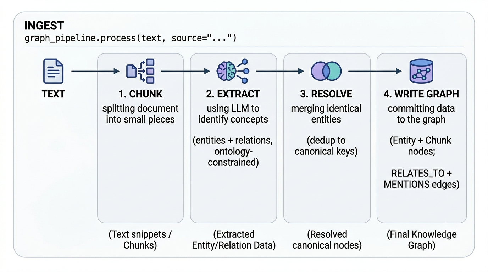

# Ingesting documents

Ingestion is how `runic.rag` turns raw text into a knowledge graph. Each
document is chunked, the chunks are mined for entities and relations, those
entities are deduplicated against what is already in the graph, and the whole
result is written as one unit of work. Every write is an idempotent `MERGE`, so
re-ingesting the same text never creates duplicates and shared entities collapse
onto one canonical node — even across documents.

This page covers the pipeline, the two ingest verbs (`ingest_text()` vs
`ingest_document()`), building one graph from many documents, loading bounded
PDF page ranges, and the cost/performance knobs that keep large runs affordable.

---

## The ingestion pipeline

`ingest_text()` and `ingest_document()` both run the same four-stage write
pipeline. Stages 1–3 fan out and are cached/budgeted; stage 4 commits
everything in a single writer transaction.



1. **Chunk.** The text is split into overlapping paragraphs
   (`chunk_size` / `chunk_overlap`). Each chunk keeps its `source` tag and a
   sequence number.
2. **Extract.** Every chunk is sent to the LLM in parallel to extract entities
   and relations, constrained to the [ontology](./ontologies.md)'s entity types.
   Chunk texts are then embedded in one batched pass.
3. **Resolve.** Each extracted entity is mapped to a canonical key — a
   deterministic key plus vector dedup against the store — so surface variants
   ("Ada Lovelace", "Lovelace") collapse onto one node.
4. **Write.** Inside one `GraphStore.writer()` transaction the service writes
   `Chunk` nodes (with embeddings), upserts `Entity` nodes, creates `RELATES_TO`
   edges between entities, and records `Chunk-[:MENTIONS]->Entity` provenance.
   Every statement is a `MERGE`, which is what makes ingestion idempotent.

The `MENTIONS` edge is the provenance backbone: it records which chunk (and
therefore which `source`) mentioned each entity, so an answer can cite the
original document even after entities have been merged. See
[concepts](./concepts.md) for why the graph is built this way, and
[ontologies](./ontologies.md) for tuning what the extractor pulls out.

::: info
The vector index used during extraction and dedup is created by
`bootstrap_schema()`, which is idempotent. Call it once on startup before your
first ingest — it raises `ValueError` if `embedding_dim <= 0`.
:::

---

## `ingest_text` vs `ingest_document`

Use `ingest_text()` for strings you already hold in memory; use
`ingest_document()` to load a file from disk.

`ingest_text(text, *, source)` ingests a raw string. The `source` keyword is
**required** — it is the provenance tag that ends up on every chunk and in every
citation, so make it meaningful.

```python
from runic.rag import GraphRAG, Ontology, RagSettings

rag = GraphRAG.with_defaults(settings=RagSettings())
rag.bootstrap_schema()

report = rag.ingest_text(
    "Ada Lovelace worked with Charles Babbage on the Analytical Engine.",
    source="inline-demo",
)
print(
    f"Ingested: {report.chunks} chunks, {report.entities} entities, "
    f"{report.relations} relations, {report.mentions} mentions"
)
```

`ingest_document(path)` loads a file and dispatches by extension before running
the same pipeline. `source` is set to the string form of `path`.

| Extension | Loader |
| --- | --- |
| `.pdf` | `documents.load_pdf` |
| `.md` / `.markdown` | `documents.load_markdown` |
| anything else | `documents.load_text` |

```python
report = rag.ingest_document("docs/whitepaper.pdf")
```

Both verbs return an `IngestionReport` — a frozen value object with the counts
written this run:

| Field | Meaning |
| --- | --- |
| `chunks` | `Chunk` nodes persisted |
| `entities` | distinct entities upserted (after resolution) |
| `relations` | `RELATES_TO` edges created |
| `mentions` | `Chunk-[:MENTIONS]->Entity` provenance edges |

Because every write is a `MERGE`, the report counts *distinct* graph elements,
not raw operations. Re-ingesting identical text yields identical counts and adds
nothing to the graph.

::: info
`with_defaults(settings=...)` is the driverless form: it builds a FalkorDB
driver on `localhost:6379` from `settings.backend`. To target a different
backend or an existing driver, see [configuration](./configuration.md).
:::

---

## Ingesting multiple documents

To build one graph from several documents, call `ingest_text()` once per
document with a distinct `source`. Entities that recur across documents `MERGE`
onto a single canonical node (entity resolution); their mentions stay attributed
to the document each came from. This is what separates a *graph* RAG from a flat
vector store.

```python
CORPUS: dict[str, str] = {
    "lovelace_biography.txt": DOC_BIOGRAPHY,
    "analytical_engine.txt": DOC_MACHINE,
    "lovelace_legacy.txt": DOC_LEGACY,
    "modern_pioneers.txt": DOC_MODERN,
}

for source, text in CORPUS.items():
    report = rag.ingest_text(text, source=source)
    print(
        f"  {source:<24} "
        f"chunks={report.chunks}  entities={report.entities}  "
        f"relations={report.relations}  mentions={report.mentions}"
    )
```

To *prove* the dedup worked, inspect `answer.context` after a query. The
retrieval context exposes the canonical entities behind the answer: an entity
reached from several documents appears exactly **once** in `context.entities`,
while the citations span multiple sources.

```python
answer = rag.query(
    "How is Ada Lovelace connected to the Analytical Engine and Alan Turing?",
    mode="hybrid",
)

# Each canonical entity shows up once, no matter how many docs mentioned it.
context = answer.context
if context is not None:
    for entity in context.entities:
        print(
            f"  - {entity.name} ({entity.type}) "
            f"key={entity.canonical_key} score={entity.score:.4f}"
        )

# Provenance lives on the citations, which span the source documents.
sources_seen = {citation.source for citation in answer.citations}
print(f"distinct sources cited: {len(sources_seen)} of {len(CORPUS)}")
```

Each `EntityHit` carries `name`, `type`, `canonical_key`, `description`, and a
`score`; `RelationHit` exposes `source_key`, `target_key`, `rel_type`, and
`description` for the edges traversed in the graph. Always guard `answer.context`
for `None` — it is populated on retrieval but may be absent.

::: info
The full runnable version is
[examples/rag/03_multiple_documents.py](https://github.com/jenreh/runic/blob/main/examples/rag/03_multiple_documents.py).
:::

---

## Loading PDFs

For text/Markdown/PDF on disk, `ingest_document()` is the one-liner. When you
need a **bounded** slice of a large PDF — to keep a run cheap or to ingest one
section — use the loaders in `runic.rag.adapters.documents` directly and feed the
text to `ingest_text()`.

```python
from runic.rag.adapters import documents

# 1-based, inclusive page range; out-of-range bounds are clamped to the doc.
pages = documents.load_pdf_pages(
    "BusinessMagazin.pdf", first_page=1, last_page=8
)
text = "\n\n".join(page_text for _, page_text in pages)

report = rag.ingest_text(text, source="manager-magazin:pages-1-8")
```

`load_pdf_pages(path, *, first_page=None, last_page=None)` returns a
`list[tuple[int, str]]` of `(page_number, text)` pairs, page numbers 1-based, so
you can report or process pages individually. `first_page` / `last_page` are
1-based and inclusive; `None` means "from the start" / "to the end".

To load an entire PDF as one string, use `load_pdf(path)`:

```python
text = documents.load_pdf("BusinessMagazin.pdf")
report = rag.ingest_text(text, source="manager-magazin:all-pages")
```

::: info
The flagship PDF walkthrough is
[examples/rag/04_manager_magazin_pdf.py](https://github.com/jenreh/runic/blob/main/examples/rag/04_manager_magazin_pdf.py),
which ingests the same slice under two ontologies and compares the results.
:::

---

## Controlling cost & performance

Ingestion calls the LLM once per chunk and the embedder in batches, so a large
corpus can be expensive. `RagSettings` exposes four levers. Override them on a
loaded settings object with `model_copy`, then pass it to `with_defaults`:

```python
from runic.rag import GraphRAG, load_settings

settings = load_settings().model_copy(
    update={
        "max_llm_calls": 300,   # hard cap on LLM calls (0 = unlimited)
        "max_tokens": 0,        # hard cap on estimated tokens (0 = unlimited)
        "embed_batch_size": 128,
        "concurrency": 8,
        "requests_per_minute": 0,
        "cache_dir": ".cache/runic-rag",
    }
)
rag = GraphRAG.with_defaults(settings=settings)
```

**`BudgetGuard` (`max_llm_calls` / `max_tokens`).** A hard ceiling on spend.
`with_defaults` builds **one shared** `BudgetGuard` that spans ingestion *and*
the query path, so the caps cover the whole run rather than each component in
isolation. The guard checks *before* each request and records usage only after a
call succeeds (so failed calls cost nothing); exceeding a limit raises
`BudgetExceededError`. `0` means unlimited. Tokens are a tiktoken estimate, not a
provider's billed usage.

**Content cache (`cache_dir`).** Extractions and embeddings are memoised in a
content-addressed cache keyed by content hash. Re-ingesting unchanged text — or
a corpus that overlaps a previous run — skips the LLM and embedder entirely.
Point `cache_dir` at a persistent path to make re-ingestion nearly free.

**Batched embeddings (`embed_batch_size`).** Chunk and entity texts are embedded
in one `embed_batch` request per group of `embed_batch_size` texts instead of
one request per text, so a document with K distinct texts issues
`ceil(K / embed_batch_size)` requests. Each batch counts as a single budget /
rate-limit unit.

**Concurrency & throttling (`concurrency` / `requests_per_minute`).**
Per-chunk extraction runs in parallel across `concurrency` workers.
`requests_per_minute` rate-limits every LLM/embedder request (`0` disables the
limit) — raise concurrency for speed, set a rate limit to stay under a provider
quota.

::: warning
A run that exceeds `max_llm_calls` or `max_tokens` raises
`BudgetExceededError` mid-ingest. Set caps generously enough to cover the
document, or leave them at `0` and rely on the cache to avoid repeat spend.
:::

The full environment-variable table (`RUNIC_RAG_*`) lives in
[configuration](./configuration.md).

---

## Recommendations

::: tip

- **Tag a meaningful `source` per document.** It is what shows up in citations
  (`Citation.source`) and on every `MENTIONS` edge — a stable, human-readable id
  pays off when you trace an answer back to its origin.
- **Cap cost on big PDFs.** Set `max_llm_calls` before ingesting a large
  document so a runaway extraction fails fast instead of draining your quota.
- **Make re-ingestion cheap.** Set `RUNIC_RAG_CACHE_DIR` (or `cache_dir`) to a
  persistent path; repeated and overlapping ingests then skip the LLM and
  embedder via the content cache.
- **Ingest related documents into ONE graph.** Shared entities `MERGE` onto a
  single canonical node, so cross-document questions traverse a connected graph
  instead of isolated islands.
:::

---

## Next steps

::: info See also

- [Retrieval & answers](./retrieval.md) — how questions are answered, retrieval modes, and `answer.context`
- [Designing & optimizing ontologies](./ontologies.md) — tune what the extractor pulls out of each chunk
- [Configuration & deployment](./configuration.md) — the full `RUNIC_RAG_*` settings reference
- [API Reference](./api.md) — `IngestionReport`, `documents.load_pdf_pages`, and the rest of the surface
- [examples/rag/03_multiple_documents.py](https://github.com/jenreh/runic/blob/main/examples/rag/03_multiple_documents.py) — multi-document ingestion + dedup proof
- [examples/rag/04_manager_magazin_pdf.py](https://github.com/jenreh/runic/blob/main/examples/rag/04_manager_magazin_pdf.py) — bounded PDF ingestion with a cost budget
:::
